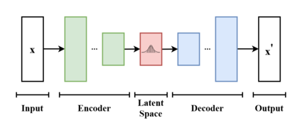
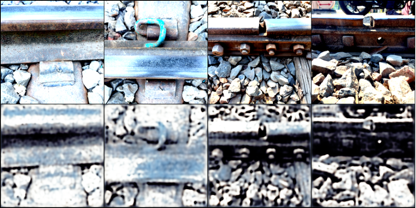

# Generative model
According to different data and different task goals, this repositories lists four generative models I built.  
Including VAE, GAN, CNN-LSTM and Unet-SelfAttention.

## VAE model
The VAE model consists of two main components: an `encoder` and a `decoder`. 

The encoder takes input data, such as images, and maps it to a lower-dimensional latent space representation. The decoder then takes samples from this latent space and reconstructs the original data.  

During training, the VAE aims to minimize a loss function that measures the difference between the input data and the reconstructed data, while also encouraging the distributions outputted by the encoder and decoder to be similar to a predefined prior distribution (often a simple Gaussian distribution).

  

 

### Task and Dataset
Generate similar images based on the given image.

`Dataset`: https://www.kaggle.com/datasets/salmaneunus/railway-track-fault-detection

### Performance
The upper line is the original image, and the lower line is the generated image.

  

 

### Important concept

### Training loss of VAE:  

Total loss = `Reconstruction loss` + 0.001 * `KL Divergence Loss` 

`Reconstruction Loss` = Use a pixel-level loss function, such as mean square error (MSE), to compare the difference between the input image and the reconstructed image generated by the model. 

`KL Divergence Loss` = This loss function measures the difference between the distribution of the latent space encoding learned by the model and the predefined prior distribution. 

## GAN model

## CNN-LSTM model

## Unet-Self Attention model

