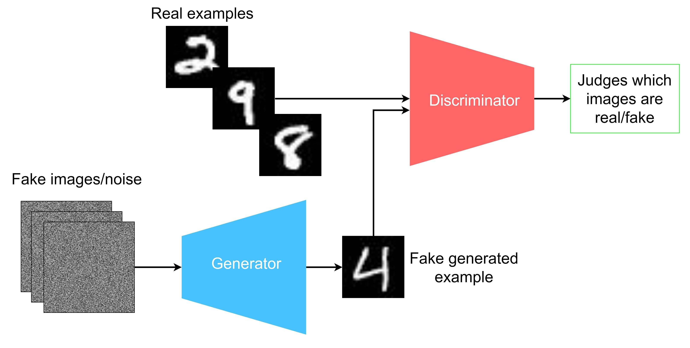
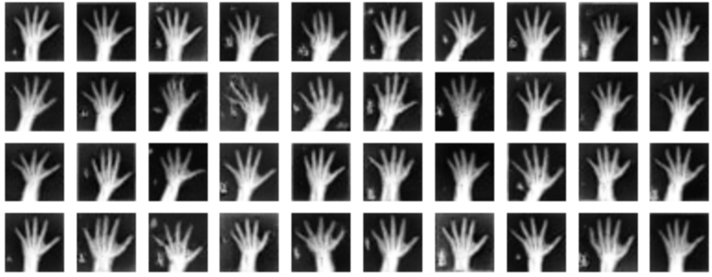
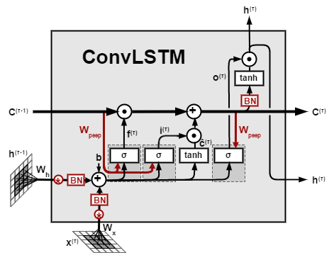
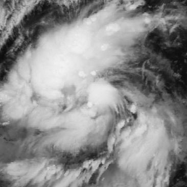
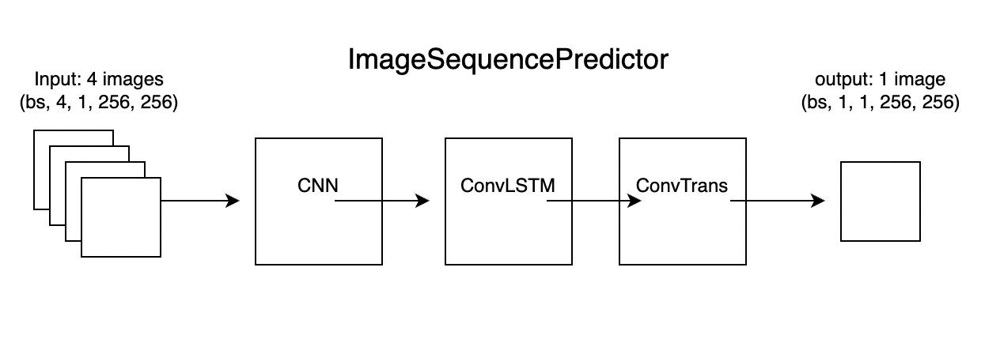

# Generative model
According to different data and different task goals, this repositories lists four generative models I built.  
Including VAE, GAN, CNN-LSTM and Unet-SelfAttention.

## VAE model
The VAE model consists of two main components: an `encoder` and a `decoder`. 

The encoder takes input data, such as images, and maps it to a lower-dimensional latent space representation. The decoder then takes samples from this latent space and reconstructs the original data.  

During training, the VAE aims to minimize a loss function that measures the difference between the input data and the reconstructed data, while also encouraging the distributions outputted by the encoder and decoder to be similar to a predefined prior distribution (often a simple Gaussian distribution).

  

 

### Task and Dataset
Generate similar images based on the given image.

`Dataset`: https://www.kaggle.com/datasets/salmaneunus/railway-track-fault-detection

### Performance
The upper line is the original image, and the lower line is the generated image.

  

 

### Important concept

#### Training loss of VAE:  

Total loss = `Reconstruction loss` + 0.001 * `KL Divergence Loss` 

`Reconstruction Loss` = Use a pixel-level loss function, such as mean square error (MSE), to compare the difference between the input image and the reconstructed image generated by the model. 

`KL Divergence Loss` = This loss function measures the difference between the distribution of the latent space encoding learned by the model and the predefined prior distribution. 

## GAN model 
GAN consists of two main parts: generator and discriminator. 

`Generator`: Generate realistic data samples from random noise. It usually consists of a series of deconvolution layers and activation functions. 

`Discriminator`: The discriminator divides the input data samples into real data and generated data. It usually consists of a series of convolutional layers and activation functions, and its output is a probability value between 0 and 1, indicating the probability that the input data is real data.

  

 

### Task and Dataset 
Generate similar images based on the given image.

Dataset: `real_image` folder (More than 5,000 real images were used during the training process, and only 20 are given here for demonstration). 

### Performance 
The picture below shows the images generated by the trained GAN, and you can compare it with the real images for real_image folder. 

  

 

### Important concept

#### Adversarial Training: 

The training of GAN is an adversarial process in which the generator and the discriminator compete and confront each other. The generator tries to generate realistic data to fool the discriminator, while the discriminator tries to differentiate between real data and generated data. This adversarial training method allows the model to gradually improve its capabilities and generate more realistic data samples.

## CNN-ConvLSTM model
ConvLSTM introduces convolution operations to enhance LSTM so that it can effectively process spatiotemporal sequence data. The basic idea is to combine convolutional layers and LSTM units to process both spatiotemporal and temporal information in a sequence. 

  

 

### Task and Dataset
Given satellite images from a particular storm, the model should generate 3 future satellite images at 3 given future timestamps.

`Dataset`: The training dataset consists of satellite images of 30 tropical storms around the Atlantic and East Pacific Oceans. Each storm has a varying number of time samples with irregular time intervals.

Example data are in the `data` folder. 

  

 

### Model structure
#### ConvLSTMCell and ConvLSTM
The `ConvLSTMCell` class defines a single ConvLSTM unit that combines the long-term dependency capturing capabilities of LSTMs with the spatial hierarchy of convolutional neural networks (CNN).

Internal structure: Use the convolution operation to combine the input tensor and the hidden state of the previous moment, and then process it through the convolution kernel. The output is divided into four parts: input gate, forget gate, output gate and unit state. The hidden state and unit state are updated through Sigmoid and Tanh activation functions.

The `ConvLSTM` class encapsulates multiple ConvLSTMCell to form a complete ConvLSTM layer.

#### ImageSequencePredictor
The `ImageSequencePredictor` class mainly consists of three parts: 

Simple CNN layer: used to extract features from each frame of image. 

ConvLSTM layer: receives features from CNN as input and captures the temporal dynamics of the image sequence. 

Transposed convolution layer: used to upsample the output of the ConvLSTM back to the dimensions of the original image to generate a predicted image sequence. 

### Important concept
#### SSIM Loss function
SSIM (Structural Similarity Index Measure) loss is a commonly used evaluation metric in image processing tasks, used to measure the visual similarity between two images. SSIM is a statistical measure based on three compared image pairs: brightness, contrast and structure. 

When two images are identical, the value of SSIM is 1 and the SSIM loss is 0. As the difference between the two images increases, the SSIM value decreases and the corresponding SSIM loss increases. By minimizing the SSIM loss, the model is trained to generate predicted images that are more structurally similar to the target image.

## CAE-ConvLSTM model
Based on the previous ConvLSTM generative network, I modified two parts. First, in the initial feature extraction, I replaced the simple one-layer CNN with two layers. Second, in the final method of restoring the image, I replaced the difference method with deconvolution. In general, the current model structure looks like a CAE model with ConvLSTM wrapped in the middle.

  

 

## Unet-Self Attention model

